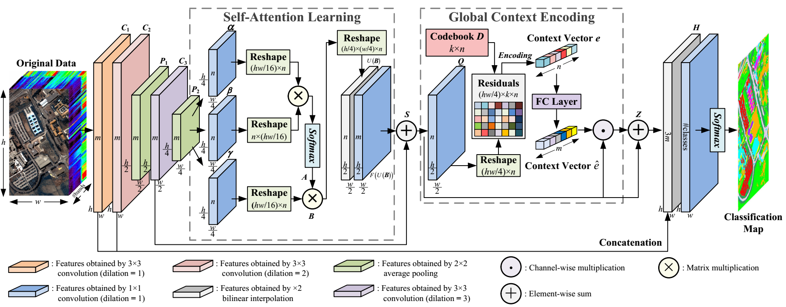
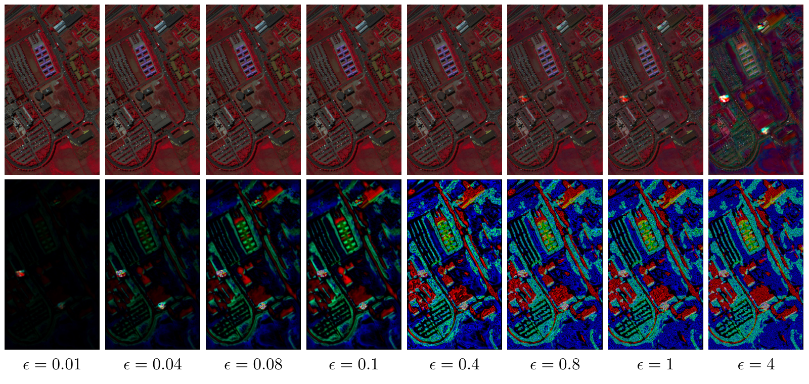

# Self-Attention Context Network for Hyperspectral Image Classification

PyTorch implementation of our method for adversarial attacks and defenses in hyperspectral image classification.



## Installation
* Install `Pytorch 1.4.0` from https://github.com/pytorch/pytorch with `Python 3.7`.

* Clone this repo.
```
git clone https://github.com/YonghaoXu/SACNet
```


## Dataset
* Download the [Pavia University image](http://www.ehu.eus/ccwintco/uploads/e/ee/PaviaU.mat) and the corresponding [annotations](http://www.ehu.eus/ccwintco/uploads/5/50/PaviaU_gt.mat). Put these files into the `Data` folder.

## Usage
* Data Preparation:
  - `python GenSample.py`
* Adversarial Attack with the FGSM:
  - `CUDA_VISIBLE_DEVICES=0 python Attack_FGSM.py`
* Adversarial Examples Visualization:
  - `CUDA_VISIBLE_DEVICES=0 python GenAdvExample.py`



## Paper
[Self-Attention Context Network: Addressing the Threat of Adversarial Attacks for Hyperspectral Image Classification](https://ieeexplore.ieee.org/document/9573256/)

Please cite our paper if you find it useful for your research.

```
@article{sacnet,
  title={Self-Attention Context Network: Addressing the Threat of Adversarial Attacks for Hyperspectral Image Classification}, 
  author={Xu, Yonghao and Du, Bo and Zhang, Liangpei},
  journal={IEEE Transactions on Image Processing}, 
  year={2021},
  volume={},
  number={},
  pages={1-1},
  doi={10.1109/TIP.2021.3118977}}
}
```


## Acknowledgment
This code is partly borrowed from [PyTorch-Encoding](https://github.com/zhanghang1989/PyTorch-Encoding)
